Telco Churn
================

## Updating Libraries

``` r
library(rio)
library(formattable)
library(dplyr)
library(tidyverse)
library(readxl)
library(corrplot)
library(stargazer)
library(car)
library(PerformanceAnalytics)
library(tidyr)
library(tm)
library(MASS)
library(AER)
library(ggplot2)
library(lubridate)
library(lattice)
library(lme4)
library(MuMIn)
library("ggridges")
library("hrbrthemes")
library(ggthemes)
library("maps")
library("mapproj")
library(cowplot)
library(ROCR)

options(scipen = 999)
```

## Importing Data

``` r
df<-read_xlsx("TelcoChurn.xlsx",sheet = "Data")
```

``` r
str(df)
```

    ## tibble [7,043 x 21] (S3: tbl_df/tbl/data.frame)
    ##  $ customerID      : chr [1:7043] "7590-VHVEG" "5575-GNVDE" "3668-QPYBK" "7795-CFOCW" ...
    ##  $ gender          : chr [1:7043] "Female" "Male" "Male" "Male" ...
    ##  $ SeniorCitizen   : num [1:7043] 0 0 0 0 0 0 0 0 0 0 ...
    ##  $ Partner         : chr [1:7043] "Yes" "No" "No" "No" ...
    ##  $ Dependents      : chr [1:7043] "No" "No" "No" "No" ...
    ##  $ tenure          : num [1:7043] 1 34 2 45 2 8 22 10 28 62 ...
    ##  $ PhoneService    : chr [1:7043] "No" "Yes" "Yes" "No" ...
    ##  $ MultipleLines   : chr [1:7043] "No phone service" "No" "No" "No phone service" ...
    ##  $ InternetService : chr [1:7043] "DSL" "DSL" "DSL" "DSL" ...
    ##  $ OnlineSecurity  : chr [1:7043] "No" "Yes" "Yes" "Yes" ...
    ##  $ OnlineBackup    : chr [1:7043] "Yes" "No" "Yes" "No" ...
    ##  $ DeviceProtection: chr [1:7043] "No" "Yes" "No" "Yes" ...
    ##  $ TechSupport     : chr [1:7043] "No" "No" "No" "Yes" ...
    ##  $ StreamingTV     : chr [1:7043] "No" "No" "No" "No" ...
    ##  $ StreamingMovies : chr [1:7043] "No" "No" "No" "No" ...
    ##  $ Contract        : chr [1:7043] "Month-to-month" "One year" "Month-to-month" "One year" ...
    ##  $ PaperlessBilling: chr [1:7043] "Yes" "No" "Yes" "No" ...
    ##  $ PaymentMethod   : chr [1:7043] "Electronic check" "Mailed check" "Mailed check" "Bank transfer (automatic)" ...
    ##  $ MonthlyCharges  : num [1:7043] 29.9 57 53.9 42.3 70.7 ...
    ##  $ TotalCharges    : num [1:7043] 29.9 1889.5 108.2 1840.8 151.7 ...
    ##  $ Churn           : chr [1:7043] "No" "No" "Yes" "No" ...

## Checking Nulls

``` r
colSums(is.na(df))
```

    ##       customerID           gender    SeniorCitizen          Partner 
    ##                0                0                0                0 
    ##       Dependents           tenure     PhoneService    MultipleLines 
    ##                0                0                0                0 
    ##  InternetService   OnlineSecurity     OnlineBackup DeviceProtection 
    ##                0                0                0                0 
    ##      TechSupport      StreamingTV  StreamingMovies         Contract 
    ##                0                0                0                0 
    ## PaperlessBilling    PaymentMethod   MonthlyCharges     TotalCharges 
    ##                0                0                0               11 
    ##            Churn 
    ##                0

## Dropping Nulls

``` r
df<-na.omit(df)
```

## Converting to factor and releveling

``` r
df$gender<-as.factor(df$gender)
df$SeniorCitizen<-as.factor(df$SeniorCitizen)
df$Partner<-as.factor(df$Partner)
df$Dependents<-as.factor(df$Dependents)
df$Contract<-as.factor(df$Contract)
df$PaperlessBilling<-as.factor(df$PaperlessBilling)
df$Churn <- ifelse(df$Churn=="Yes", 1, 0)
df$Churn<-as.factor(df$Churn)
```

## Making separate datasets for telephone only, Internet only and customers that use both services

``` r
Both<-subset(df, PhoneService=='Yes' & InternetService!='No')
Telephone<-subset(df, PhoneService=='Yes' & InternetService=='No')
Internet<-subset(df, PhoneService=='No' & InternetService!='No')
```

## Preparing data for customers that use both, Telephone and Internet Services

``` r
unique(Both$PhoneService)
```

    ## [1] "Yes"

``` r
Both$MultipleLines<-as.factor(Both$MultipleLines)
Both$OnlineSecurity<-as.factor(Both$OnlineSecurity)
Both$OnlineBackup<-as.factor(Both$OnlineBackup)
Both$DeviceProtection<-as.factor(Both$DeviceProtection)
Both$TechSupport<-as.factor(Both$TechSupport)
Both$StreamingTV<-as.factor(Both$StreamingTV)
Both$StreamingMovies<-as.factor(Both$StreamingMovies)
Both$PaymentMethod<-as.factor(Both$PaymentMethod)
Both$InternetService<-as.factor(Both$InternetService)
Both$PhoneService<-NULL
summary(Both)
```

    ##   customerID           gender     SeniorCitizen Partner    Dependents
    ##  Length:4832        Female:2408   0:3846        No :2481   No :3574  
    ##  Class :character   Male  :2424   1: 986        Yes:2351   Yes:1258  
    ##  Mode  :character                                                    
    ##                                                                      
    ##                                                                      
    ##                                                                      
    ##      tenure      MultipleLines    InternetService OnlineSecurity
    ##  Min.   : 1.00   No :2205      DSL        :1736   No :3098      
    ##  1st Qu.: 9.00   Yes:2627      Fiber optic:3096   Yes:1734      
    ##  Median :30.00                                                  
    ##  Mean   :33.06                                                  
    ##  3rd Qu.:56.00                                                  
    ##  Max.   :72.00                                                  
    ##  OnlineBackup DeviceProtection TechSupport StreamingTV StreamingMovies
    ##  No :2693     No :2717         No :3079    No :2412    No :2399       
    ##  Yes:2139     Yes:2115         Yes:1753    Yes:2420    Yes:2433       
    ##                                                                       
    ##                                                                       
    ##                                                                       
    ##                                                                       
    ##            Contract    PaperlessBilling                   PaymentMethod 
    ##  Month-to-month:2975   No :1495         Bank transfer (automatic):1068  
    ##  One year      : 964   Yes:3337         Credit card (automatic)  :1037  
    ##  Two year      : 893                    Electronic check         :2017  
    ##                                         Mailed check             : 710  
    ##                                                                         
    ##                                                                         
    ##  MonthlyCharges    TotalCharges    Churn   
    ##  Min.   : 42.90   Min.   :  42.9   0:3246  
    ##  1st Qu.: 69.79   1st Qu.: 659.6   1:1586  
    ##  Median : 82.50   Median :2350.6           
    ##  Mean   : 81.76   Mean   :2902.5           
    ##  3rd Qu.: 95.70   3rd Qu.:4871.1           
    ##  Max.   :118.75   Max.   :8684.8

## Preparing data for Telephone Only Customers

``` r
Telephone$MultipleLines<-as.factor(Telephone$MultipleLines)
Telephone$PaymentMethod<-as.factor(Telephone$PaymentMethod)

Telephone$PhoneService<-NULL
Telephone$OnlineSecurity<-NULL
Telephone$OnlineBackup<-NULL
Telephone$DeviceProtection<-NULL
Telephone$TechSupport<-NULL
Telephone$StreamingTV<-NULL
Telephone$StreamingMovies<-NULL
Telephone$InternetService<-NULL
summary(Telephone)
```

    ##   customerID           gender    SeniorCitizen Partner   Dependents
    ##  Length:1520        Female:746   0:1468        No :787   No :883   
    ##  Class :character   Male  :774   1:  52        Yes:733   Yes:637   
    ##  Mode  :character                                                  
    ##                                                                    
    ##                                                                    
    ##                                                                    
    ##      tenure      MultipleLines           Contract   PaperlessBilling
    ##  Min.   : 1.00   No :1180      Month-to-month:524   No :1075        
    ##  1st Qu.: 8.00   Yes: 340      One year      :363   Yes: 445        
    ##  Median :25.00                 Two year      :633                   
    ##  Mean   :30.67                                                      
    ##  3rd Qu.:53.00                                                      
    ##  Max.   :72.00                                                      
    ##                    PaymentMethod MonthlyCharges   TotalCharges    Churn   
    ##  Bank transfer (automatic):332   Min.   :18.25   Min.   :  18.8   0:1407  
    ##  Credit card (automatic)  :331   1st Qu.:19.70   1st Qu.: 159.9   1: 113  
    ##  Electronic check         :122   Median :20.15   Median : 523.7           
    ##  Mailed check             :735   Mean   :21.08   Mean   : 665.2           
    ##                                  3rd Qu.:20.90   3rd Qu.:1110.0           
    ##                                  Max.   :26.90   Max.   :2007.0

## Preparing data for Internet Only Customers

``` r
Internet$PaymentMethod<-as.factor(Internet$PaymentMethod)
Internet$OnlineSecurity<-as.factor(Internet$OnlineSecurity)
Internet$OnlineBackup<-as.factor(Internet$OnlineBackup)
Internet$DeviceProtection<-as.factor(Internet$DeviceProtection)
Internet$TechSupport<-as.factor(Internet$TechSupport)
Internet$StreamingTV<-as.factor(Internet$StreamingTV)
Internet$StreamingMovies<-as.factor(Internet$StreamingMovies)


Internet$MultipleLines<-NULL
Internet$PhoneService<-NULL
Internet$InternetService<-NULL
summary(Internet)
```

    ##   customerID           gender    SeniorCitizen Partner   Dependents
    ##  Length:680         Female:329   0:576         No :371   No :476   
    ##  Class :character   Male  :351   1:104         Yes:309   Yes:204   
    ##  Mode  :character                                                  
    ##                                                                    
    ##                                                                    
    ##                                                                    
    ##      tenure      OnlineSecurity OnlineBackup DeviceProtection TechSupport
    ##  Min.   : 1.00   No :399        No :394      No :377          No :393    
    ##  1st Qu.: 8.00   Yes:281        Yes:286      Yes:303          Yes:287    
    ##  Median :29.00                                                           
    ##  Mean   :31.83                                                           
    ##  3rd Qu.:53.00                                                           
    ##  Max.   :72.00                                                           
    ##  StreamingTV StreamingMovies           Contract   PaperlessBilling
    ##  No :397     No :382         Month-to-month:376   No :294         
    ##  Yes:283     Yes:298         One year      :145   Yes:386         
    ##                              Two year      :159                   
    ##                                                                   
    ##                                                                   
    ##                                                                   
    ##                    PaymentMethod MonthlyCharges   TotalCharges     Churn  
    ##  Bank transfer (automatic):142   Min.   :23.45   Min.   :  23.45   0:510  
    ##  Credit card (automatic)  :153   1st Qu.:33.60   1st Qu.: 298.96   1:170  
    ##  Electronic check         :226   Median :40.55   Median :1153.80          
    ##  Mailed check             :159   Mean   :41.99   Mean   :1500.43          
    ##                                  3rd Qu.:50.66   3rd Qu.:2465.18          
    ##                                  Max.   :67.20   Max.   :4919.70

``` r
colSums(is.na(Internet))
```

    ##       customerID           gender    SeniorCitizen          Partner 
    ##                0                0                0                0 
    ##       Dependents           tenure   OnlineSecurity     OnlineBackup 
    ##                0                0                0                0 
    ## DeviceProtection      TechSupport      StreamingTV  StreamingMovies 
    ##                0                0                0                0 
    ##         Contract PaperlessBilling    PaymentMethod   MonthlyCharges 
    ##                0                0                0                0 
    ##     TotalCharges            Churn 
    ##                0                0

``` r
knitr::opts_chunk$set(echo = TRUE,fig.width = 12,fig.height = 20)
```

## Visualizing predictors with churn possibility - BOTH

``` r
df2<-table(Both$Churn,Both$gender)
df2<-round(100*prop.table(df2),digits=0)
df2<-as.data.frame(df2)


p<-ggplot(df2, aes(Var2, Freq)) + geom_bar(aes(fill = Var1), stat = "identity", position = "dodge")+xlab("Gender")+ylab("Percentage")
a<-p+scale_fill_discrete(name = "Churn", labels = c("No", "Yes"))

df2<-table(Both$Churn,Both$Partner)
df2<-round(100*prop.table(df2),digits=0)
df2<-as.data.frame(df2)


p<-ggplot(df2, aes(Var2, Freq)) + geom_bar(aes(fill = Var1), stat = "identity", position = "dodge")+xlab("Partner")+ylab("Percentage")
b<-p+scale_fill_discrete(name = "Churn", labels = c("No", "Yes"))

df2<-table(Both$Churn,Both$Dependents)
df2<-round(100*prop.table(df2),digits=0)
df2<-as.data.frame(df2)


p<-ggplot(df2, aes(Var2, Freq)) + geom_bar(aes(fill = Var1), stat = "identity", position = "dodge")+xlab("Dependents")+ylab("Percentage")
c<-p+scale_fill_discrete(name = "Churn", labels = c("No", "Yes"))

df2<-table(Both$Churn,Both$MultipleLines)
df2<-round(100*prop.table(df2),digits=0)
df2<-as.data.frame(df2)


p<-ggplot(df2, aes(Var2, Freq)) + geom_bar(aes(fill = Var1), stat = "identity", position = "dodge")+xlab("Multiple Lines")+ylab("Percentage")
d<-p+scale_fill_discrete(name = "Churn", labels = c("No", "Yes"))

df2<-table(Both$Churn,Both$InternetService)
df2<-round(100*prop.table(df2),digits=0)
df2<-as.data.frame(df2)


p<-ggplot(df2, aes(Var2, Freq)) + geom_bar(aes(fill = Var1), stat = "identity", position = "dodge")+xlab("Internet Service")+ylab("Percentage")
e<-p+scale_fill_discrete(name = "Churn", labels = c("No", "Yes"))

df2<-table(Both$Churn,Both$OnlineSecurity)
df2<-round(100*prop.table(df2),digits=0)
df2<-as.data.frame(df2)


p<-ggplot(df2, aes(Var2, Freq)) + geom_bar(aes(fill = Var1), stat = "identity", position = "dodge")+xlab("Online Security")+ylab("Percentage")
f<-p+scale_fill_discrete(name = "Churn", labels = c("No", "Yes"))

df2<-table(Both$Churn,Both$OnlineBackup)
df2<-round(100*prop.table(df2),digits=0)
df2<-as.data.frame(df2)


p<-ggplot(df2, aes(Var2, Freq)) + geom_bar(aes(fill = Var1), stat = "identity", position = "dodge")+xlab("Online Backup")+ylab("Percentage")
g<-p+scale_fill_discrete(name = "Churn", labels = c("No", "Yes"))

df2<-table(Both$Churn,Both$DeviceProtection)
df2<-round(100*prop.table(df2),digits=0)
df2<-as.data.frame(df2)


p<-ggplot(df2, aes(Var2, Freq)) + geom_bar(aes(fill = Var1), stat = "identity", position = "dodge")+xlab("Device Protection")+ylab("Percentage")
h<-p+scale_fill_discrete(name = "Churn", labels = c("No", "Yes"))

df2<-table(Both$Churn,Both$TechSupport)
df2<-round(100*prop.table(df2),digits=0)
df2<-as.data.frame(df2)


p<-ggplot(df2, aes(Var2, Freq)) + geom_bar(aes(fill = Var1), stat = "identity", position = "dodge")+xlab("Tech Support")+ylab("Percentage")
i<-p+scale_fill_discrete(name = "Churn", labels = c("No", "Yes"))

df2<-table(Both$Churn,Both$StreamingTV)
df2<-round(100*prop.table(df2),digits=0)
df2<-as.data.frame(df2)


p<-ggplot(df2, aes(Var2, Freq)) + geom_bar(aes(fill = Var1), stat = "identity", position = "dodge")+xlab("Streaming TV")+ylab("Percentage")
j<-p+scale_fill_discrete(name = "Churn", labels = c("No", "Yes"))

df2<-table(Both$Churn,Both$StreamingMovies)
df2<-round(100*prop.table(df2),digits=0)
df2<-as.data.frame(df2)


p<-ggplot(df2, aes(Var2, Freq)) + geom_bar(aes(fill = Var1), stat = "identity", position = "dodge")+xlab("Streaming Movies")+ylab("Percentage")
k<-p+scale_fill_discrete(name = "Churn", labels = c("No", "Yes"))

df2<-table(Both$Churn,Both$Contract)
df2<-round(100*prop.table(df2),digits=0)
df2<-as.data.frame(df2)


p<-ggplot(df2, aes(Var2, Freq)) + geom_bar(aes(fill = Var1), stat = "identity", position = "dodge")+xlab("Contract")+ylab("Percentage")
l<-p+scale_fill_discrete(name = "Churn", labels = c("No", "Yes"))

df2<-table(Both$Churn,Both$PaperlessBilling)
df2<-round(100*prop.table(df2),digits=0)
df2<-as.data.frame(df2)


p<-ggplot(df2, aes(Var2, Freq)) + geom_bar(aes(fill = Var1), stat = "identity", position = "dodge")+xlab("Paperless Billing")+ylab("Percentage")
m<-p+scale_fill_discrete(name = "Churn", labels = c("No", "Yes"))

df2<-table(Both$Churn,Both$SeniorCitizen)
df2<-round(100*prop.table(df2),digits=0)
df2<-as.data.frame(df2)

p<-ggplot(df2, aes(Var2, Freq)) + geom_bar(aes(fill = Var1), stat = "identity", position = "dodge")+xlab("Senior Citizen")+ylab("Percentage")
o<-p+scale_fill_discrete(name = "Churn", labels = c("No", "Yes"))

df2<-table(Both$Churn,Both$PaymentMethod)
df2<-round(100*prop.table(df2),digits=0)
df2<-as.data.frame(df2)

p<-ggplot(df2, aes(Var2, Freq)) + geom_bar(aes(fill = Var1), stat = "identity", position = "dodge")+xlab("Payment Method")+ylab("Percentage")
n<-p+scale_fill_discrete(name = "Churn", labels = c("No", "Yes"))

cowplot::plot_grid(a, b,c,d,e,f,g,h,i,j,k,l,m,n,o,ncol = 3)
```

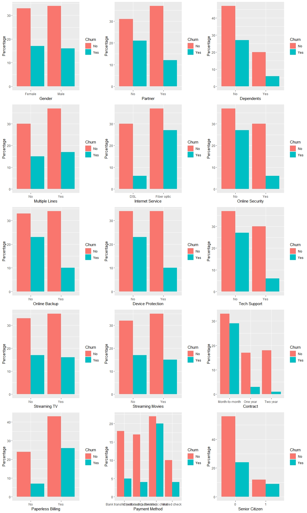<!-- -->

``` r
knitr::opts_chunk$set(echo = TRUE,fig.width = 8,fig.height = 5.5)
```

``` r
a<-Both %>%
  group_by(Churn) %>%
  ggplot()+
  geom_boxplot(aes(x=Churn,y=tenure,fill="coral"))+
  guides(fill=FALSE)

b<-Both %>%
  group_by(Churn) %>%
  ggplot()+
  geom_boxplot(aes(x=Churn,y=MonthlyCharges,fill="coral"))+
  guides(fill=FALSE)

c<-Both %>%
  group_by(Churn) %>%
  ggplot()+
  geom_boxplot(aes(x=Churn,y=TotalCharges,fill="coral"))+
  guides(fill=FALSE)

cowplot::plot_grid(a, b,c,ncol = 3)
```

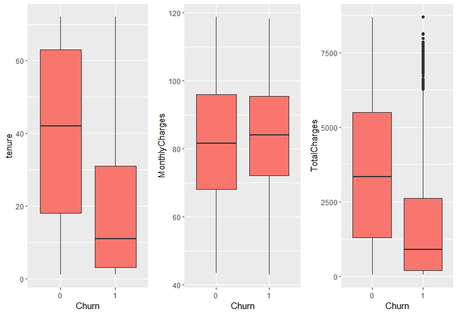<!-- -->

``` r
numerics=Both[c('tenure','MonthlyCharges','TotalCharges')]
correlations=cor(numerics)
d<-corrplot(correlations,method = "number",type="upper")
```

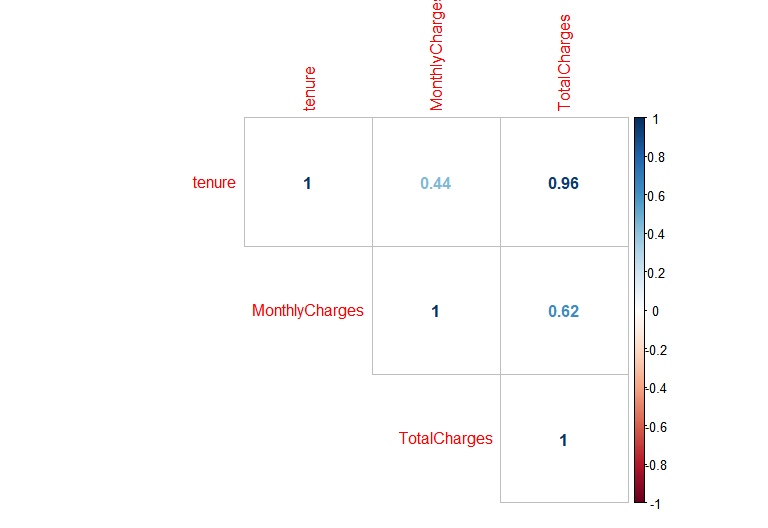<!-- -->

## Separating Data sets into training and test - BOTH

``` r
set.seed(1024)
trainIndex <- sample(1:nrow(Both), size=round(0.75*nrow(Both)), replace=FALSE)
train <- Both[trainIndex,]
test  <- Both[-trainIndex,]
dim(train); dim(test)
```

    ## [1] 3624   20

    ## [1] 1208   20

``` r
summary(train)
```

    ##   customerID           gender     SeniorCitizen Partner    Dependents
    ##  Length:3624        Female:1835   0:2878        No :1885   No :2692  
    ##  Class :character   Male  :1789   1: 746        Yes:1739   Yes: 932  
    ##  Mode  :character                                                    
    ##                                                                      
    ##                                                                      
    ##                                                                      
    ##      tenure      MultipleLines    InternetService OnlineSecurity
    ##  Min.   : 1.00   No :1643      DSL        :1283   No :2345      
    ##  1st Qu.: 9.00   Yes:1981      Fiber optic:2341   Yes:1279      
    ##  Median :30.00                                                  
    ##  Mean   :32.95                                                  
    ##  3rd Qu.:56.00                                                  
    ##  Max.   :72.00                                                  
    ##  OnlineBackup DeviceProtection TechSupport StreamingTV StreamingMovies
    ##  No :2017     No :2035         No :2337    No :1792    No :1791       
    ##  Yes:1607     Yes:1589         Yes:1287    Yes:1832    Yes:1833       
    ##                                                                       
    ##                                                                       
    ##                                                                       
    ##                                                                       
    ##            Contract    PaperlessBilling                   PaymentMethod 
    ##  Month-to-month:2247   No :1094         Bank transfer (automatic): 776  
    ##  One year      : 714   Yes:2530         Credit card (automatic)  : 799  
    ##  Two year      : 663                    Electronic check         :1553  
    ##                                         Mailed check             : 496  
    ##                                                                         
    ##                                                                         
    ##  MonthlyCharges    TotalCharges    Churn   
    ##  Min.   : 42.90   Min.   :  42.9   0:2421  
    ##  1st Qu.: 69.94   1st Qu.: 651.5   1:1203  
    ##  Median : 83.20   Median :2356.3           
    ##  Mean   : 81.91   Mean   :2894.4           
    ##  3rd Qu.: 95.66   3rd Qu.:4871.7           
    ##  Max.   :118.75   Max.   :8684.8

## Creating the model - BOTH

``` r
reg1  <- glm(Churn ~ SeniorCitizen+ Partner+ Dependents + MultipleLines + InternetService + OnlineSecurity + OnlineBackup + DeviceProtection + TechSupport + Contract + PaperlessBilling+PaymentMethod+tenure,family=binomial (link="logit"),data=train)
summary(reg1)
```

    ## 
    ## Call:
    ## glm(formula = Churn ~ SeniorCitizen + Partner + Dependents + 
    ##     MultipleLines + InternetService + OnlineSecurity + OnlineBackup + 
    ##     DeviceProtection + TechSupport + Contract + PaperlessBilling + 
    ##     PaymentMethod + tenure, family = binomial(link = "logit"), 
    ##     data = train)
    ## 
    ## Deviance Residuals: 
    ##     Min       1Q   Median       3Q      Max  
    ## -1.8429  -0.7988  -0.3539   0.8734   3.0211  
    ## 
    ## Coefficients:
    ##                                       Estimate Std. Error z value
    ## (Intercept)                          -0.862901   0.156570  -5.511
    ## SeniorCitizen1                        0.189643   0.102546   1.849
    ## PartnerYes                           -0.051890   0.097476  -0.532
    ## DependentsYes                        -0.050487   0.114187  -0.442
    ## MultipleLinesYes                      0.440087   0.093099   4.727
    ## InternetServiceFiber optic            0.915438   0.105377   8.687
    ## OnlineSecurityYes                    -0.389850   0.102715  -3.795
    ## OnlineBackupYes                      -0.126578   0.092442  -1.369
    ## DeviceProtectionYes                   0.072805   0.093052   0.782
    ## TechSupportYes                       -0.218201   0.104223  -2.094
    ## ContractOne year                     -0.375013   0.136988  -2.738
    ## ContractTwo year                     -1.040787   0.230467  -4.516
    ## PaperlessBillingYes                   0.402810   0.097017   4.152
    ## PaymentMethodCredit card (automatic)  0.165319   0.143366   1.153
    ## PaymentMethodElectronic check         0.476772   0.119289   3.997
    ## PaymentMethodMailed check             0.137128   0.156339   0.877
    ## tenure                               -0.032949   0.002959 -11.137
    ##                                                  Pr(>|z|)    
    ## (Intercept)                                  0.0000000356 ***
    ## SeniorCitizen1                                   0.064409 .  
    ## PartnerYes                                       0.594496    
    ## DependentsYes                                    0.658383    
    ## MultipleLinesYes                             0.0000022776 ***
    ## InternetServiceFiber optic           < 0.0000000000000002 ***
    ## OnlineSecurityYes                                0.000147 ***
    ## OnlineBackupYes                                  0.170916    
    ## DeviceProtectionYes                              0.433975    
    ## TechSupportYes                                   0.036295 *  
    ## ContractOne year                                 0.006190 ** 
    ## ContractTwo year                             0.0000063020 ***
    ## PaperlessBillingYes                          0.0000329622 ***
    ## PaymentMethodCredit card (automatic)             0.248857    
    ## PaymentMethodElectronic check                0.0000642107 ***
    ## PaymentMethodMailed check                        0.380421    
    ## tenure                               < 0.0000000000000002 ***
    ## ---
    ## Signif. codes:  0 '***' 0.001 '**' 0.01 '*' 0.05 '.' 0.1 ' ' 1
    ## 
    ## (Dispersion parameter for binomial family taken to be 1)
    ## 
    ##     Null deviance: 4606.5  on 3623  degrees of freedom
    ## Residual deviance: 3542.3  on 3607  degrees of freedom
    ## AIC: 3576.3
    ## 
    ## Number of Fisher Scoring iterations: 5

``` r
vif(reg1)
```

    ##                      GVIF Df GVIF^(1/(2*Df))
    ## SeniorCitizen    1.111341  1        1.054202
    ## Partner          1.356956  1        1.164884
    ## Dependents       1.264475  1        1.124489
    ## MultipleLines    1.278058  1        1.130512
    ## InternetService  1.261059  1        1.122969
    ## OnlineSecurity   1.100931  1        1.049253
    ## OnlineBackup     1.157981  1        1.076095
    ## DeviceProtection 1.178317  1        1.085503
    ## TechSupport      1.162133  1        1.078023
    ## Contract         1.673111  2        1.137316
    ## PaperlessBilling 1.057868  1        1.028527
    ## PaymentMethod    1.204984  3        1.031566
    ## tenure           2.267043  1        1.505670

``` r
dwtest(reg1)
```

    ## 
    ##  Durbin-Watson test
    ## 
    ## data:  reg1
    ## DW = 2.047, p-value = 0.9216
    ## alternative hypothesis: true autocorrelation is greater than 0

## Calculating Accuracy, Precision, Recall and F-1 Score

``` r
test_x <- test[ , c(1:19)]
predlogit <-predict(reg1, newdata=test_x, type="response")
predlogit <- ifelse(predlogit>0.4, 1, 0)

ConfusionMatrix<-table(test$Churn, predlogit)                         # Confusion matrix
ClassificationError <- mean(predlogit != test$Churn) # Classification error

pr <- prediction(predlogit, test$Churn)
prf <- performance(pr, measure="tpr", x.measure="fpr")
plot(prf)                                                 # ROC plot: TPR vs FPR
```

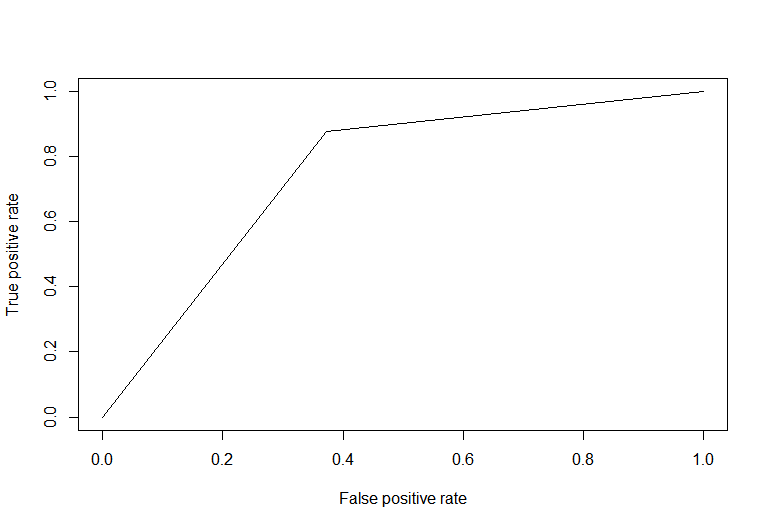<!-- -->

``` r
auc <- performance(pr, measure="auc")
auc <- auc@y.values[[1]]

TP = ConfusionMatrix[2,2]
TN = ConfusionMatrix[1,1]
FN = ConfusionMatrix[1,2]
FP = ConfusionMatrix[2,1]

precision<- round(TP / (TP + FP), 2)
recall<- round(TP / (TP + FN), 2)
f1_score<- round((2 * precision * recall) / (precision + recall), 2)

print(paste("Accuracy = ", 1-ClassificationError))
```

    ## [1] "Accuracy =  0.762417218543046"

``` r
print(paste("AUC = ", auc))
```

    ## [1] "AUC =  0.733037423846823"

``` r
print(paste("Precision = ", precision))
```

    ## [1] "Precision =  0.65"

``` r
print(paste("Recall = ", recall))
```

    ## [1] "Recall =  0.62"

``` r
print(paste("F-1 Score = ", f1_score))
```

    ## [1] "F-1 Score =  0.63"

``` r
knitr::opts_chunk$set(echo = TRUE,fig.width = 12,fig.height = 15)
```

## Visualizing predictors with churn possibility - Telephone only

``` r
df2<-table(Telephone$Churn,Telephone$gender)
df2<-round(100*prop.table(df2),digits=0)
df2<-as.data.frame(df2)


p<-ggplot(df2, aes(Var2, Freq)) + geom_bar(aes(fill = Var1), stat = "identity", position = "dodge")+xlab("Gender")+ylab("Percentage")
a<-p+scale_fill_discrete(name = "Churn", labels = c("No", "Yes"))

df2<-table(Telephone$Churn,Telephone$Partner)
df2<-round(100*prop.table(df2),digits=0)
df2<-as.data.frame(df2)


p<-ggplot(df2, aes(Var2, Freq)) + geom_bar(aes(fill = Var1), stat = "identity", position = "dodge")+xlab("Partner")+ylab("Percentage")
b<-p+scale_fill_discrete(name = "Churn", labels = c("No", "Yes"))

df2<-table(Telephone$Churn,Telephone$Dependents)
df2<-round(100*prop.table(df2),digits=0)
df2<-as.data.frame(df2)


p<-ggplot(df2, aes(Var2, Freq)) + geom_bar(aes(fill = Var1), stat = "identity", position = "dodge")+xlab("Dependents")+ylab("Percentage")
c<-p+scale_fill_discrete(name = "Churn", labels = c("No", "Yes"))

df2<-table(Telephone$Churn,Telephone$MultipleLines)
df2<-round(100*prop.table(df2),digits=0)
df2<-as.data.frame(df2)


p<-ggplot(df2, aes(Var2, Freq)) + geom_bar(aes(fill = Var1), stat = "identity", position = "dodge")+xlab("Multiple Lines")+ylab("Percentage")
d<-p+scale_fill_discrete(name = "Churn", labels = c("No", "Yes"))

df2<-table(Telephone$Churn,Telephone$SeniorCitizen)
df2<-round(100*prop.table(df2),digits=0)
df2<-as.data.frame(df2)


p<-ggplot(df2, aes(Var2, Freq)) + geom_bar(aes(fill = Var1), stat = "identity", position = "dodge")+xlab("Senior Citizen")+ylab("Percentage")
e<-p+scale_fill_discrete(name = "Churn", labels = c("No", "Yes"))


df2<-table(Telephone$Churn,Telephone$Contract)
df2<-round(100*prop.table(df2),digits=0)
df2<-as.data.frame(df2)


p<-ggplot(df2, aes(Var2, Freq)) + geom_bar(aes(fill = Var1), stat = "identity", position = "dodge")+xlab("Contract")+ylab("Percentage")
f<-p+scale_fill_discrete(name = "Churn", labels = c("No", "Yes"))

df2<-table(Telephone$Churn,Telephone$PaperlessBilling)
df2<-round(100*prop.table(df2),digits=0)
df2<-as.data.frame(df2)


p<-ggplot(df2, aes(Var2, Freq)) + geom_bar(aes(fill = Var1), stat = "identity", position = "dodge")+xlab("Paperless Billing")+ylab("Percentage")
g<-p+scale_fill_discrete(name = "Churn", labels = c("No", "Yes"))

df2<-table(Telephone$Churn,Telephone$PaymentMethod)
df2<-round(100*prop.table(df2),digits=0)
df2<-as.data.frame(df2)

p<-ggplot(df2, aes(Var2, Freq)) + geom_bar(aes(fill = Var1), stat = "identity", position = "dodge")+xlab("Payment Method")+ylab("Percentage")
h<-p+scale_fill_discrete(name = "Churn", labels = c("No", "Yes"))

cowplot::plot_grid(a, b,c,d,e,f,g,h,ncol = 3)
```

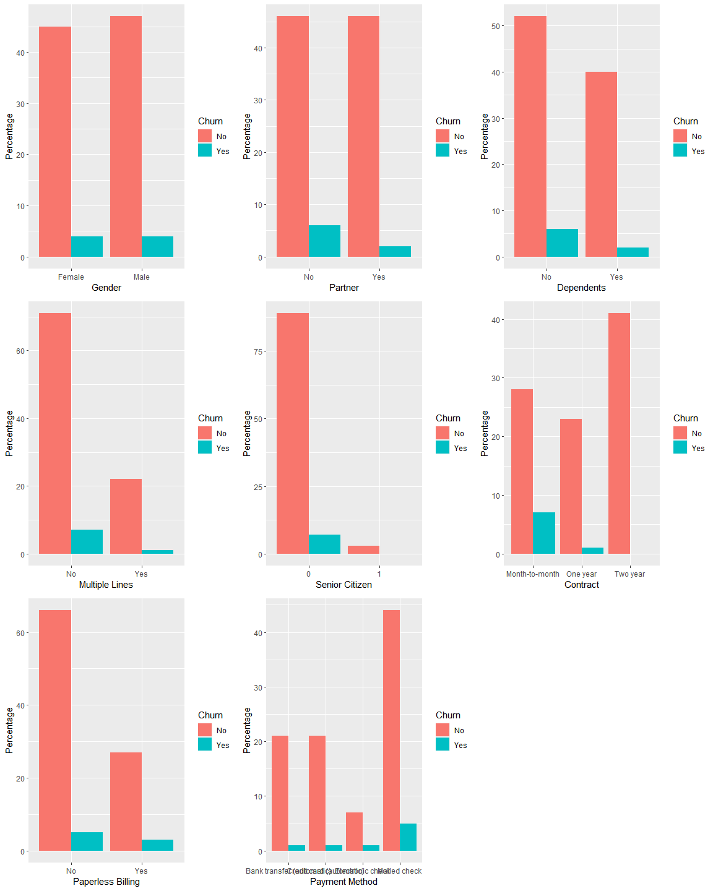<!-- -->

``` r
knitr::opts_chunk$set(echo = TRUE,fig.width = 8,fig.height = 5.5)
```

``` r
a<-Telephone %>%
  group_by(Churn) %>%
  ggplot()+
  geom_boxplot(aes(x=Churn,y=tenure,fill="coral"))+
  guides(fill=FALSE)

b<-Telephone %>%
  group_by(Churn) %>%
  ggplot()+
  geom_boxplot(aes(x=Churn,y=MonthlyCharges,fill="coral"))+
  guides(fill=FALSE)

c<-Telephone %>%
  group_by(Churn) %>%
  ggplot()+
  geom_boxplot(aes(x=Churn,y=TotalCharges,fill="coral"))+
  guides(fill=FALSE)

cowplot::plot_grid(a, b,c,ncol = 3)      
```

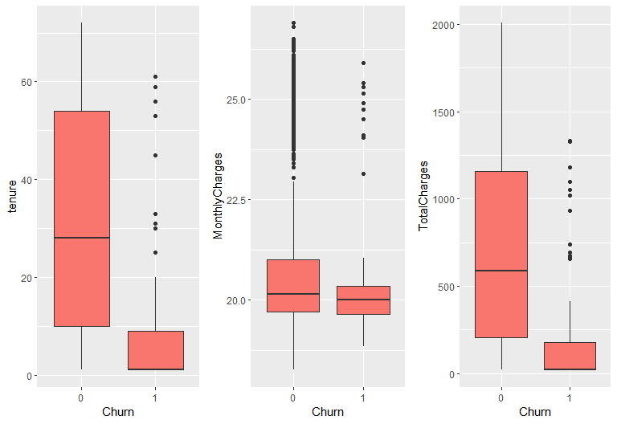<!-- -->

``` r
numerics=Telephone[c('tenure','MonthlyCharges','TotalCharges')]
correlations=cor(numerics)
corrplot(correlations,method = "number",type="upper")
```

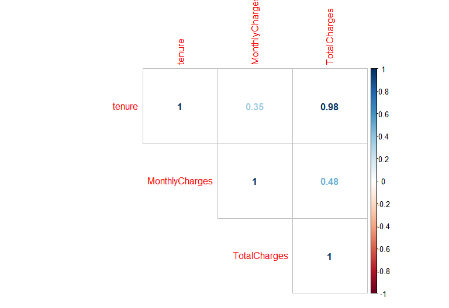<!-- -->

## Separating Data sets into training and test - Telephone only

``` r
set.seed(1024)
trainIndex <- sample(1:nrow(Telephone), size=round(0.75*nrow(Telephone)), replace=FALSE)
train <- Telephone[trainIndex,]
test  <- Telephone[-trainIndex,]
dim(train); dim(test)
```

    ## [1] 1140   13

    ## [1] 380  13

``` r
summary(train)
```

    ##   customerID           gender    SeniorCitizen Partner   Dependents
    ##  Length:1140        Female:546   0:1104        No :587   No :659   
    ##  Class :character   Male  :594   1:  36        Yes:553   Yes:481   
    ##  Mode  :character                                                  
    ##                                                                    
    ##                                                                    
    ##                                                                    
    ##      tenure      MultipleLines           Contract   PaperlessBilling
    ##  Min.   : 1.00   No :891       Month-to-month:381   No :823         
    ##  1st Qu.: 8.00   Yes:249       One year      :285   Yes:317         
    ##  Median :25.00                 Two year      :474                   
    ##  Mean   :30.79                                                      
    ##  3rd Qu.:53.00                                                      
    ##  Max.   :72.00                                                      
    ##                    PaymentMethod MonthlyCharges   TotalCharges    Churn   
    ##  Bank transfer (automatic):265   Min.   :18.25   Min.   :  18.8   0:1056  
    ##  Credit card (automatic)  :255   1st Qu.:19.70   1st Qu.: 164.3   1:  84  
    ##  Electronic check         : 92   Median :20.15   Median : 527.4           
    ##  Mailed check             :528   Mean   :21.05   Mean   : 667.3           
    ##                                  3rd Qu.:20.85   3rd Qu.:1107.9           
    ##                                  Max.   :26.90   Max.   :2007.0

## Creating the model - Telephone only

``` r
reg2  <- glm(Churn ~ Partner+ Dependents + MultipleLines + Contract + PaperlessBilling+PaymentMethod+tenure,family=binomial (link="logit"),data=train)
summary(reg2)
```

    ## 
    ## Call:
    ## glm(formula = Churn ~ Partner + Dependents + MultipleLines + 
    ##     Contract + PaperlessBilling + PaymentMethod + tenure, family = binomial(link = "logit"), 
    ##     data = train)
    ## 
    ## Deviance Residuals: 
    ##     Min       1Q   Median       3Q      Max  
    ## -1.0234  -0.4118  -0.1893  -0.0924   3.3770  
    ## 
    ## Coefficients:
    ##                                      Estimate Std. Error z value Pr(>|z|)
    ## (Intercept)                          -0.80891    0.34436  -2.349 0.018823
    ## PartnerYes                           -0.13027    0.34487  -0.378 0.705618
    ## DependentsYes                         0.04121    0.33547   0.123 0.902242
    ## MultipleLinesYes                      0.36758    0.41357   0.889 0.374116
    ## ContractOne year                     -1.16897    0.40117  -2.914 0.003570
    ## ContractTwo year                     -1.60090    0.55861  -2.866 0.004159
    ## PaperlessBillingYes                   0.32392    0.25683   1.261 0.207223
    ## PaymentMethodCredit card (automatic) -0.99533    0.48868  -2.037 0.041674
    ## PaymentMethodElectronic check        -0.20905    0.44136  -0.474 0.635743
    ## PaymentMethodMailed check            -0.50120    0.33550  -1.494 0.135204
    ## tenure                               -0.04725    0.01240  -3.811 0.000138
    ##                                         
    ## (Intercept)                          *  
    ## PartnerYes                              
    ## DependentsYes                           
    ## MultipleLinesYes                        
    ## ContractOne year                     ** 
    ## ContractTwo year                     ** 
    ## PaperlessBillingYes                     
    ## PaymentMethodCredit card (automatic) *  
    ## PaymentMethodElectronic check           
    ## PaymentMethodMailed check               
    ## tenure                               ***
    ## ---
    ## Signif. codes:  0 '***' 0.001 '**' 0.01 '*' 0.05 '.' 0.1 ' ' 1
    ## 
    ## (Dispersion parameter for binomial family taken to be 1)
    ## 
    ##     Null deviance: 599.79  on 1139  degrees of freedom
    ## Residual deviance: 474.31  on 1129  degrees of freedom
    ## AIC: 496.31
    ## 
    ## Number of Fisher Scoring iterations: 7

``` r
vif(reg2)
```

    ##                      GVIF Df GVIF^(1/(2*Df))
    ## Partner          1.663737  1        1.289859
    ## Dependents       1.608124  1        1.268118
    ## MultipleLines    1.125764  1        1.061020
    ## Contract         1.546748  2        1.115205
    ## PaperlessBilling 1.030580  1        1.015175
    ## PaymentMethod    1.132914  3        1.021017
    ## tenure           1.628559  1        1.276150

``` r
dwtest(reg2)
```

    ## 
    ##  Durbin-Watson test
    ## 
    ## data:  reg2
    ## DW = 2.0107, p-value = 0.5714
    ## alternative hypothesis: true autocorrelation is greater than 0

## Calculating Accuracy, Precision, Recall and F-1 Score

``` r
test_x <- test[ , c(1:12)]
predlogit <-predict(reg2, newdata=test_x, type="response")
predlogit <- ifelse(predlogit>0.19, 1, 0)

ConfusionMatrix<-table(test$Churn, predlogit) # Confusion matrix
ConfusionMatrix
```

    ##    predlogit
    ##       0   1
    ##   0 301  50
    ##   1   9  20

``` r
ClassificationError <- mean(predlogit != test$Churn) # Classification error

pr <- prediction(predlogit, test$Churn)
prf <- performance(pr, measure="tpr", x.measure="fpr")
plot(prf)                                                 # ROC plot: TPR vs FPR
```

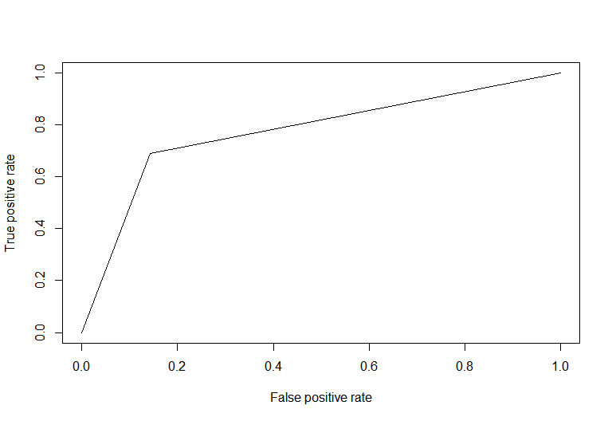<!-- -->

``` r
auc <- performance(pr, measure="auc")
auc <- auc@y.values[[1]]

TP = ConfusionMatrix[2,2]
TN = ConfusionMatrix[1,1]
FN = ConfusionMatrix[1,2]
FP = ConfusionMatrix[2,1]

precision<- round(TP / (TP + FP), 2)
recall<- round(TP / (TP + FN), 2)
f1_score<- round((2 * precision * recall) / (precision + recall), 2)

print(paste("Accuracy = ", 1-ClassificationError))
```

    ## [1] "Accuracy =  0.844736842105263"

``` r
print(paste("AUC = ", auc))
```

    ## [1] "AUC =  0.773602514981825"

``` r
print(paste("Precision = ", precision))
```

    ## [1] "Precision =  0.69"

``` r
print(paste("Recall = ", recall))
```

    ## [1] "Recall =  0.29"

``` r
print(paste("F-1 Score = ", f1_score))
```

    ## [1] "F-1 Score =  0.41"

``` r
knitr::opts_chunk$set(echo = TRUE,fig.width = 12,fig.height = 15)
```

## Visualizing predictors with churn possibility - Internet only

``` r
df2<-table(Internet$Churn,Internet$gender)
df2<-round(100*prop.table(df2),digits=0)
df2<-as.data.frame(df2)


p<-ggplot(df2, aes(Var2, Freq)) + geom_bar(aes(fill = Var1), stat = "identity", position = "dodge")+xlab("Gender")+ylab("Percentage")
a<-p+scale_fill_discrete(name = "Churn", labels = c("No", "Yes"))

df2<-table(Internet$Churn,Internet$Partner)
df2<-round(100*prop.table(df2),digits=0)
df2<-as.data.frame(df2)


p<-ggplot(df2, aes(Var2, Freq)) + geom_bar(aes(fill = Var1), stat = "identity", position = "dodge")+xlab("Partner")+ylab("Percentage")
b<-p+scale_fill_discrete(name = "Churn", labels = c("No", "Yes"))

df2<-table(Internet$Churn,Internet$Dependents)
df2<-round(100*prop.table(df2),digits=0)
df2<-as.data.frame(df2)


p<-ggplot(df2, aes(Var2, Freq)) + geom_bar(aes(fill = Var1), stat = "identity", position = "dodge")+xlab("Dependents")+ylab("Percentage")
c<-p+scale_fill_discrete(name = "Churn", labels = c("No", "Yes"))

df2<-table(Internet$Churn,Internet$SeniorCitizen)
df2<-round(100*prop.table(df2),digits=0)
df2<-as.data.frame(df2)


p<-ggplot(df2, aes(Var2, Freq)) + geom_bar(aes(fill = Var1), stat = "identity", position = "dodge")+xlab("Senior Citizen")+ylab("Percentage")
d<-p+scale_fill_discrete(name = "Churn", labels = c("No", "Yes"))


df2<-table(Internet$Churn,Internet$OnlineSecurity)
df2<-round(100*prop.table(df2),digits=0)
df2<-as.data.frame(df2)


p<-ggplot(df2, aes(Var2, Freq)) + geom_bar(aes(fill = Var1), stat = "identity", position = "dodge")+xlab("Online Security")+ylab("Percentage")
f<-p+scale_fill_discrete(name = "Churn", labels = c("No", "Yes"))

df2<-table(Internet$Churn,Internet$OnlineBackup)
df2<-round(100*prop.table(df2),digits=0)
df2<-as.data.frame(df2)


p<-ggplot(df2, aes(Var2, Freq)) + geom_bar(aes(fill = Var1), stat = "identity", position = "dodge")+xlab("Online Backup")+ylab("Percentage")
g<-p+scale_fill_discrete(name = "Churn", labels = c("No", "Yes"))

df2<-table(Internet$Churn,Internet$DeviceProtection)
df2<-round(100*prop.table(df2),digits=0)
df2<-as.data.frame(df2)


p<-ggplot(df2, aes(Var2, Freq)) + geom_bar(aes(fill = Var1), stat = "identity", position = "dodge")+xlab("Device Protection")+ylab("Percentage")
h<-p+scale_fill_discrete(name = "Churn", labels = c("No", "Yes"))

df2<-table(Internet$Churn,Internet$TechSupport)
df2<-round(100*prop.table(df2),digits=0)
df2<-as.data.frame(df2)


p<-ggplot(df2, aes(Var2, Freq)) + geom_bar(aes(fill = Var1), stat = "identity", position = "dodge")+xlab("Tech Support")+ylab("Percentage")
i<-p+scale_fill_discrete(name = "Churn", labels = c("No", "Yes"))

df2<-table(Internet$Churn,Internet$StreamingTV)
df2<-round(100*prop.table(df2),digits=0)
df2<-as.data.frame(df2)


p<-ggplot(df2, aes(Var2, Freq)) + geom_bar(aes(fill = Var1), stat = "identity", position = "dodge")+xlab("Streaming TV")+ylab("Percentage")
j<-p+scale_fill_discrete(name = "Churn", labels = c("No", "Yes"))

df2<-table(Internet$Churn,Internet$StreamingMovies)
df2<-round(100*prop.table(df2),digits=0)
df2<-as.data.frame(df2)


p<-ggplot(df2, aes(Var2, Freq)) + geom_bar(aes(fill = Var1), stat = "identity", position = "dodge")+xlab("Streaming Movies")+ylab("Percentage")
k<-p+scale_fill_discrete(name = "Churn", labels = c("No", "Yes"))

df2<-table(Internet$Churn,Internet$Contract)
df2<-round(100*prop.table(df2),digits=0)
df2<-as.data.frame(df2)


p<-ggplot(df2, aes(Var2, Freq)) + geom_bar(aes(fill = Var1), stat = "identity", position = "dodge")+xlab("Contract")+ylab("Percentage")
l<-p+scale_fill_discrete(name = "Churn", labels = c("No", "Yes"))

df2<-table(Internet$Churn,Internet$PaperlessBilling)
df2<-round(100*prop.table(df2),digits=0)
df2<-as.data.frame(df2)


p<-ggplot(df2, aes(Var2, Freq)) + geom_bar(aes(fill = Var1), stat = "identity", position = "dodge")+xlab("Paperless Billing")+ylab("Percentage")
m<-p+scale_fill_discrete(name = "Churn", labels = c("No", "Yes"))

df2<-table(Internet$Churn,Internet$PaymentMethod)
df2<-round(100*prop.table(df2),digits=0)
df2<-as.data.frame(df2)

p<-ggplot(df2, aes(Var2, Freq)) + geom_bar(aes(fill = Var1), stat = "identity", position = "dodge")+xlab("Payment Method")+ylab("Percentage")
e<-p+scale_fill_discrete(name = "Churn", labels = c("No", "Yes"))

cowplot::plot_grid(a, b,c,d,e,f,g,h,i,j,k,l,m,ncol = 3)
```

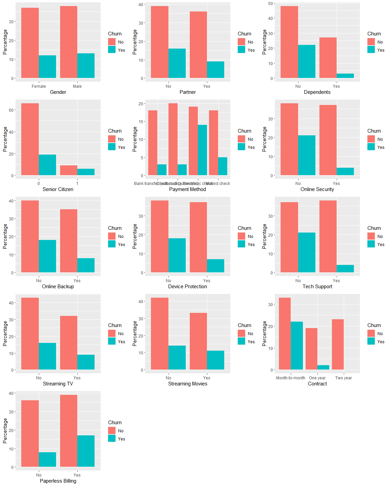<!-- -->

``` r
knitr::opts_chunk$set(echo = TRUE,fig.width = 8,fig.height = 5.5)
```

``` r
a<-Internet %>%
  group_by(Churn) %>%
  ggplot()+
  geom_boxplot(aes(x=Churn,y=tenure,fill="coral"))+
  guides(fill=FALSE)

b<-Internet %>%
  group_by(Churn) %>%
  ggplot()+
  geom_boxplot(aes(x=Churn,y=MonthlyCharges,fill="coral"))+
  guides(fill=FALSE)

c<-Internet %>%
  group_by(Churn) %>%
  ggplot()+
  geom_boxplot(aes(x=Churn,y=TotalCharges,fill="coral"))+
  guides(fill=FALSE)

cowplot::plot_grid(a, b,c,ncol = 3)
```

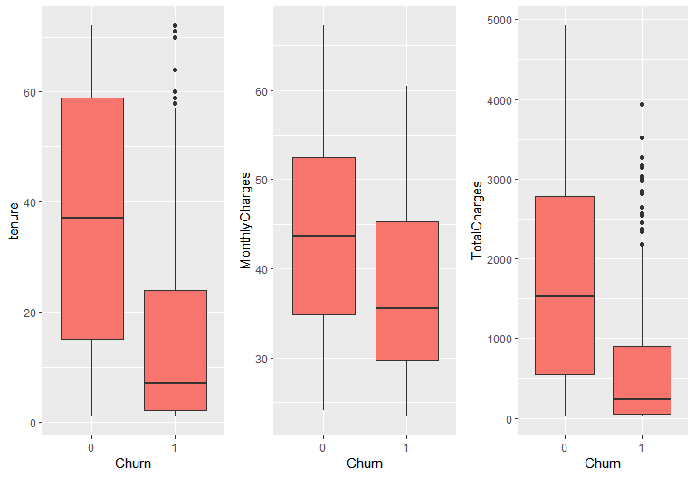<!-- -->

``` r
numerics=Internet[c('tenure','MonthlyCharges','TotalCharges')]
correlations=cor(numerics)
corrplot(correlations,method = "number",type="upper")
```

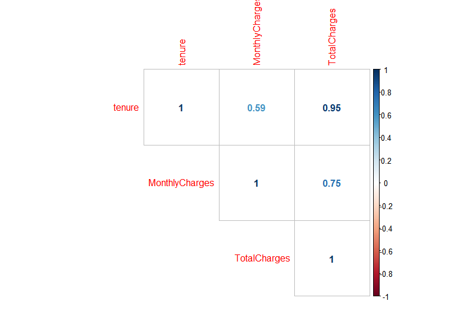<!-- -->

## Separating Data sets into training and test - Telephone only

``` r
set.seed(1024)
trainIndex <- sample(1:nrow(Internet), size=round(0.75*nrow(Internet)), replace=FALSE)
train <- Internet[trainIndex,]
test  <- Internet[-trainIndex,]
dim(train); dim(test)
```

    ## [1] 510  18

    ## [1] 170  18

``` r
summary(train)
```

    ##   customerID           gender    SeniorCitizen Partner   Dependents
    ##  Length:510         Female:244   0:435         No :285   No :365   
    ##  Class :character   Male  :266   1: 75         Yes:225   Yes:145   
    ##  Mode  :character                                                  
    ##                                                                    
    ##                                                                    
    ##                                                                    
    ##      tenure      OnlineSecurity OnlineBackup DeviceProtection TechSupport
    ##  Min.   : 1.00   No :296        No :299      No :281          No :292    
    ##  1st Qu.: 8.00   Yes:214        Yes:211      Yes:229          Yes:218    
    ##  Median :29.00                                                           
    ##  Mean   :31.78                                                           
    ##  3rd Qu.:53.75                                                           
    ##  Max.   :72.00                                                           
    ##  StreamingTV StreamingMovies           Contract   PaperlessBilling
    ##  No :301     No :283         Month-to-month:284   No :226         
    ##  Yes:209     Yes:227         One year      :109   Yes:284         
    ##                              Two year      :117                   
    ##                                                                   
    ##                                                                   
    ##                                                                   
    ##                    PaymentMethod MonthlyCharges   TotalCharges     Churn  
    ##  Bank transfer (automatic): 97   Min.   :23.45   Min.   :  23.45   0:384  
    ##  Credit card (automatic)  :113   1st Qu.:33.61   1st Qu.: 294.00   1:126  
    ##  Electronic check         :183   Median :40.60   Median :1169.25          
    ##  Mailed check             :117   Mean   :42.03   Mean   :1497.84          
    ##                                  3rd Qu.:50.59   3rd Qu.:2507.46          
    ##                                  Max.   :67.20   Max.   :4919.70

## Creating the model - Telephone only

``` r
reg3<- glm(Churn ~ Partner+ Dependents + SeniorCitizen + PaymentMethod + OnlineSecurity + OnlineBackup + DeviceProtection + TechSupport + Contract + PaperlessBilling+tenure+MonthlyCharges,family=binomial (link="logit"),data=train)
summary(reg3)
```

    ## 
    ## Call:
    ## glm(formula = Churn ~ Partner + Dependents + SeniorCitizen + 
    ##     PaymentMethod + OnlineSecurity + OnlineBackup + DeviceProtection + 
    ##     TechSupport + Contract + PaperlessBilling + tenure + MonthlyCharges, 
    ##     family = binomial(link = "logit"), data = train)
    ## 
    ## Deviance Residuals: 
    ##      Min        1Q    Median        3Q       Max  
    ## -1.80289  -0.69246  -0.29166  -0.07695   2.86408  
    ## 
    ## Coefficients:
    ##                                       Estimate Std. Error z value
    ## (Intercept)                          -0.396449   0.624620  -0.635
    ## PartnerYes                            0.361778   0.289508   1.250
    ## DependentsYes                        -0.679940   0.351205  -1.936
    ## SeniorCitizen1                        0.338021   0.325928   1.037
    ## PaymentMethodCredit card (automatic) -0.431274   0.477574  -0.903
    ## PaymentMethodElectronic check         0.244328   0.392364   0.623
    ## PaymentMethodMailed check            -0.088983   0.444657  -0.200
    ## OnlineSecurityYes                    -0.601038   0.316613  -1.898
    ## OnlineBackupYes                      -0.039846   0.277683  -0.143
    ## DeviceProtectionYes                   0.137177   0.321870   0.426
    ## TechSupportYes                       -0.782137   0.300519  -2.603
    ## ContractOne year                     -0.677832   0.403295  -1.681
    ## ContractTwo year                     -1.207039   0.676372  -1.785
    ## PaperlessBillingYes                   0.453295   0.269325   1.683
    ## tenure                               -0.039411   0.008439  -4.670
    ## MonthlyCharges                        0.014230   0.016944   0.840
    ##                                        Pr(>|z|)    
    ## (Intercept)                             0.52562    
    ## PartnerYes                              0.21143    
    ## DependentsYes                           0.05287 .  
    ## SeniorCitizen1                          0.29969    
    ## PaymentMethodCredit card (automatic)    0.36650    
    ## PaymentMethodElectronic check           0.53348    
    ## PaymentMethodMailed check               0.84139    
    ## OnlineSecurityYes                       0.05765 .  
    ## OnlineBackupYes                         0.88590    
    ## DeviceProtectionYes                     0.66997    
    ## TechSupportYes                          0.00925 ** 
    ## ContractOne year                        0.09281 .  
    ## ContractTwo year                        0.07433 .  
    ## PaperlessBillingYes                     0.09236 .  
    ## tenure                               0.00000301 ***
    ## MonthlyCharges                          0.40102    
    ## ---
    ## Signif. codes:  0 '***' 0.001 '**' 0.01 '*' 0.05 '.' 0.1 ' ' 1
    ## 
    ## (Dispersion parameter for binomial family taken to be 1)
    ## 
    ##     Null deviance: 570.26  on 509  degrees of freedom
    ## Residual deviance: 417.81  on 494  degrees of freedom
    ## AIC: 449.81
    ## 
    ## Number of Fisher Scoring iterations: 6

``` r
vif(reg3)
```

    ##                      GVIF Df GVIF^(1/(2*Df))
    ## Partner          1.295562  1        1.138228
    ## Dependents       1.240300  1        1.113688
    ## SeniorCitizen    1.134260  1        1.065016
    ## PaymentMethod    1.420840  3        1.060289
    ## OnlineSecurity   1.217678  1        1.103484
    ## OnlineBackup     1.185650  1        1.088876
    ## DeviceProtection 1.557022  1        1.247807
    ## TechSupport      1.117129  1        1.056943
    ## Contract         1.480482  2        1.103064
    ## PaperlessBilling 1.153279  1        1.073908
    ## tenure           1.759173  1        1.326338
    ## MonthlyCharges   2.051787  1        1.432406

``` r
dwtest(reg3)
```

    ## 
    ##  Durbin-Watson test
    ## 
    ## data:  reg3
    ## DW = 1.7901, p-value = 0.008576
    ## alternative hypothesis: true autocorrelation is greater than 0

``` r
test_x <- test[ , c(1:17)]
predlogit <-predict(reg3, newdata=test_x, type="response")
predlogit <- ifelse(predlogit>0.35, 1, 0)

ConfusionMatrix<-table(test$Churn, predlogit) # Confusion matrix
ConfusionMatrix
```

    ##    predlogit
    ##       0   1
    ##   0 103  23
    ##   1  13  31

``` r
ClassificationError <- mean(predlogit != test$Churn) # Classification error

pr <- prediction(predlogit, test$Churn)
prf <- performance(pr, measure="tpr", x.measure="fpr")
plot(prf)                                                 # ROC plot: TPR vs FPR
```

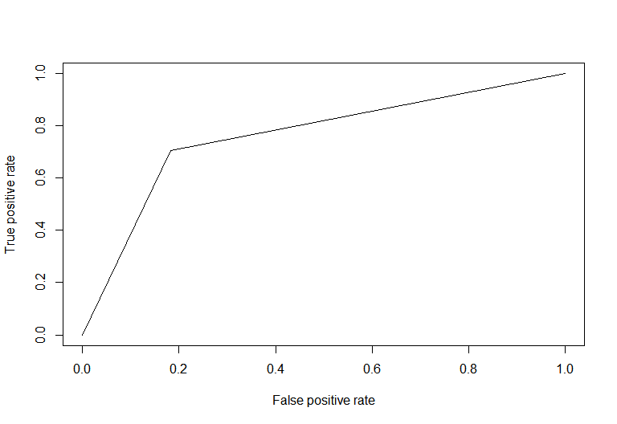<!-- -->

``` r
auc <- performance(pr, measure="auc")
auc <- auc@y.values[[1]]

TP = ConfusionMatrix[2,2]
TN = ConfusionMatrix[1,1]
FN = ConfusionMatrix[1,2]
FP = ConfusionMatrix[2,1]

precision<- round(TP / (TP + FP), 2)
recall<- round(TP / (TP + FN), 2)
f1_score<- round((2 * precision * recall) / (precision + recall), 2)

print(paste("Accuracy = ", 1-ClassificationError))
```

    ## [1] "Accuracy =  0.788235294117647"

``` r
print(paste("AUC = ", auc))
```

    ## [1] "AUC =  0.761002886002886"

``` r
print(paste("Precision = ", precision))
```

    ## [1] "Precision =  0.7"

``` r
print(paste("Recall = ", recall))
```

    ## [1] "Recall =  0.57"

``` r
print(paste("F-1 Score = ", f1_score))
```

    ## [1] "F-1 Score =  0.63"
